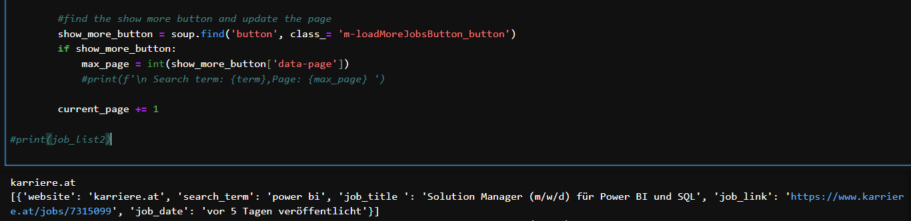
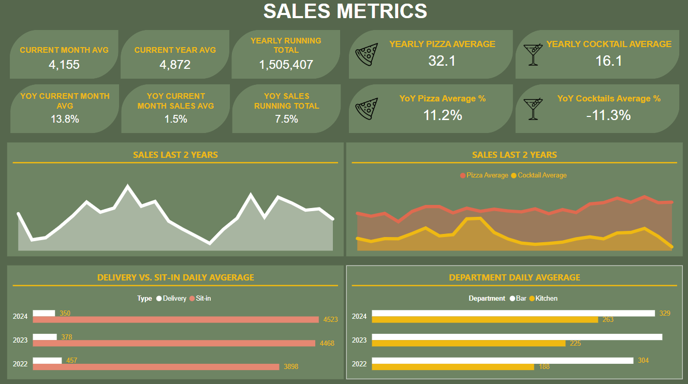
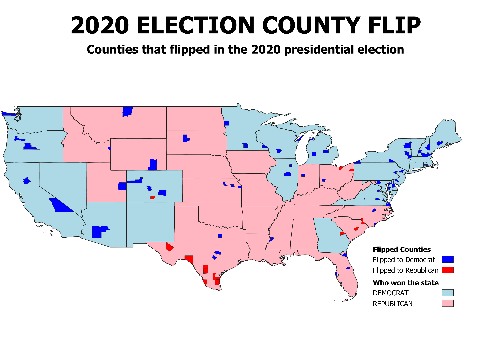
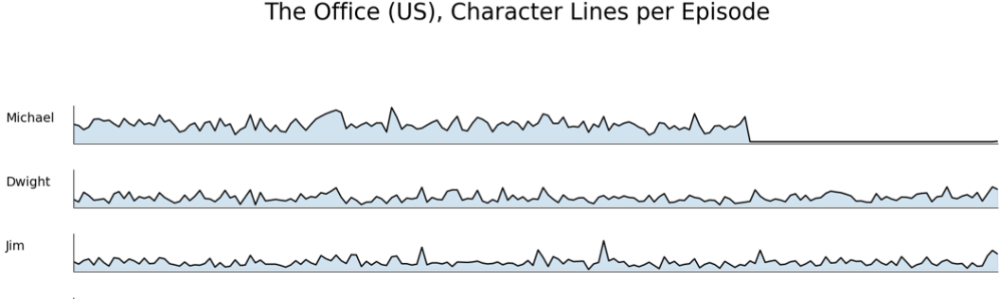

# Johannes Casera Project Portfolio

## [1. Landing My Job: Web Scraping Career Pages](job.page.md)
**#python #beautifulSoup #pandas**

<u>[Open Project](job.page.md)</u>

I used Python to scrape career pages I frequently visited, targeting keywords related to the jobs I was interested in.

## [2. Interactive Sales Dashboard for My Restaurant](powerbi.page.md)
**#python #SQL #PowerBi**

<u>[Open Project](powerbi.page.md)</u>

I created a Sales Dashboard for my restaurant, which was used weekly to support decision-making on performance and marketing strategies.

## [3. Detailed Restaurant Sales Report with R](lagambaR.page.md)
**#R #RStudio #tidyverse #ggplot2**

<u>[Open Project](lagambaR.page.md)</u>

I created a detailed sales report for my restaurant using R in RStudio. This report provided in-depth insights into our sales, enabling more comprehensive analysis.

## [4. US Election Flip Map: 2016 vs. 2020](election.page.md)
**#SQL #QGIS**

<u>[Open Project](election.page.md)</u>

I created a map highlighting all counties that flipped between the 2016 and 2020 elections. The data was aggregated using SQL, and the map was designed in QGIS.

## [5. Analyzing TV Show Scripts: Lines Per Character in The Office](theoffice.page.md)
**#python #beautifulSoup #pandas #matplotlib**

<u>[Open Project](theoffice.page.md)</u>

The Office (US) TV Show:

Ever wondered how many lines each character has in each episode? I did too, so I used Python to find out!

