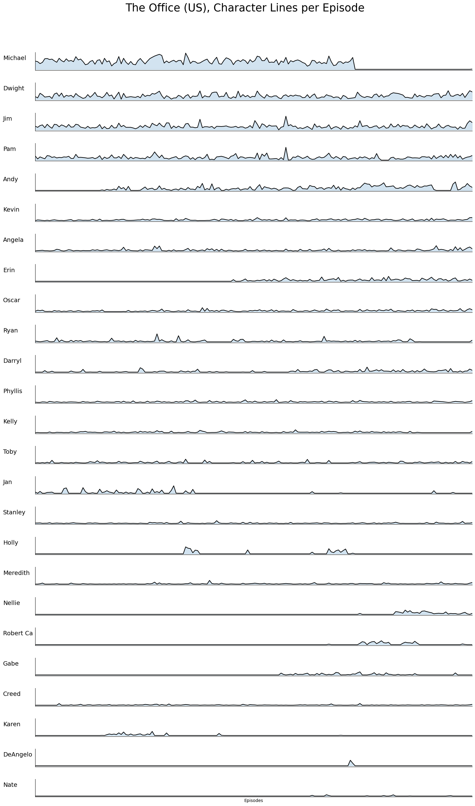

# Johannes Casera Project Portfolio

## [1. Python: Web-scraping and pandas visualization](theoffice.page.md)

The Office TV-Show: Ever wondered how many lines each character has per episode? I have, and I used python to find out.

## [2. Python + SQL + PowerBi: Restaurant Sales Dashboard](powerbi.page.md)

A Sales Dashboard for my Restaurant

