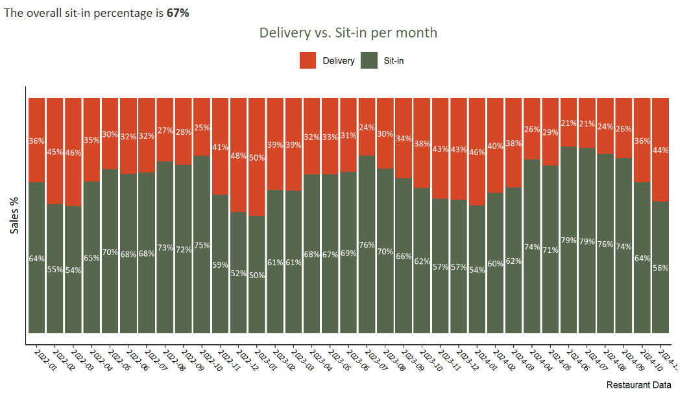

# Johannes Casera Project Portfolio

## [1. Web-scraping and pandas visualization](theoffice.page.md)
**#python #pandas #matplotlib**

*The Office (US) TV-Show:* 

Ever wondered how many lines each character has per episode? I have, and I used python to find out.

## [2. Restaurant Sales Dashboard](powerbi.page.md)
**#python #SQL #PowerBi**

A Sales Dashboard I created for my own Restaurant. The dashboard was used on a weekly basis for decision making regarding performance and marketing.

## [3. US Election map](election.page.md)
**#SQL #QGIS**

A map showing all counties that flipped from the 2016 to the 2020 elections. Data aggregated using SQL. Map created in QGIS.

## [4. Restaurant Sales Report](lagambaR.page.md)
**#R #RStudio**

A detailes sales report for my restaurant using R in R-Studio. This report was used for a more detailed analysis of our sales.

