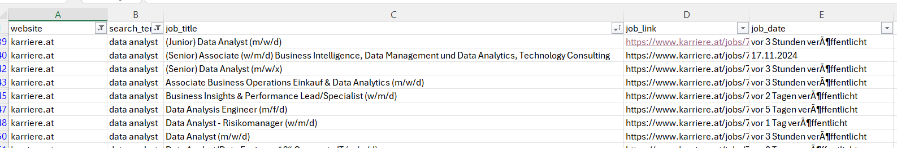

## Scraping carreer pages using relevant key words

[Back to main page](README.md)

I used Python to scrape career pages I frequently visited, targeting keywords related to the jobs I was interested in. Below are a few example pages from the results. This approach saved me a significant amount of time, as I could simply open the final CSV file and view all relevant job listings in one place. I also included date information, allowing me to filter for jobs posted in the past few days.



```python
import urllib.request, urllib.parse, urllib.error
import requests
from bs4 import BeautifulSoup
import pandas as pd
import re
```

For Karriere Suedtirol

```python
keywords = ['power bi', 'data analyst']
```


```python
url = "https://karriere-suedtirol.com/jobs/"
```


```python
job_list = []

for term in keywords:
    
    #print(f'Search term: {term}')
    current_page = 1
    max_page = 1
    match = re.search(r"https?://(www\.)?([a-zA-Z0-9.-]+)", url)
    if match:
        website = match.group(2) 

    while current_page <= max_page:
        params ={'keyword':term , 'cpage' : current_page}
        
        response = requests.get(url, params = params)

        #check for successfull request
        if response.status_code != 200:
            print(f"Failed on term: {term}, page: {current_page}")
            break

         # Parse the HTML response with BeautifulSoup
        soup = BeautifulSoup(response.text, 'html.parser')
        job_listings = soup.find_all('div', class_ = 'job-item')

        if not job_listings:
            print('No more jobs found.')
            break
            
        for job in job_listings:
            job_title = job.find('h3').get_text().strip()
            job_link = job.find('a')['href']
            job_date = job.find('span', class_ = 'job-date').get_text().strip()
            #print(f"Job title:{job_title}, Link:{job_link}, Date:{job_date}")

            job_list.append({
                'website' : website,
                'search_term' : term,
                'job_title ': job_title,
                'job_link' : job_link,
                'job_date' : job_date
                })

        #find the show more button and update the page
        show_more_button = soup.find('button', class_= 'load-page-btn')
        if show_more_button:
            max_page = int(show_more_button['data-max-page'])
            #print(f'\n Search term: {term},Page: {max_page} ')

        current_page += 1
        

```

For ReliefWeb


```python
keywords1 = ['MEAL', 'data analyst', 'Monitoring']
```

```python
url1 = "https://reliefweb.int/jobs"

response = requests.get(url1)
soup = BeautifulSoup(response.content, 'html.parser')
next_page_link = soup.find('a', rel='next')
next_page_link['href'][-1]

```


```python
job_list1 = []
base_url = 'https://reliefweb.int/'
for term in keywords1:
    
    #print(f'Search term: {term}')
    current_page = 0
    max_page = 0
    match = re.search(r"https?://(www\.)?([a-zA-Z0-9.-]+)", url1)
    if match:
        website = match.group(2) 

    while current_page <= max_page:
        params ={'river-search-input':term }
        
        response = requests.get(url1, params = params)

        #check for successfull request
        if response.status_code != 200:
            print(f"Failed on term: {term}, page: {current_page}")
            break

         # Parse the HTML response with BeautifulSoup
        soup = BeautifulSoup(response.text, 'html.parser')
        job_listings = soup.find_all('article', class_ = 'rw-river-article--card rw-river-article rw-river-article--job')

        if not job_listings:
            print('No more jobs found.')
            break
            
        for job in job_listings:
            job_title = job.find('h3').get_text().strip()
            job_link = job.find('h3').find('a')['href']
            date_text = job.find('dd',
                                 class_ = 'rw-entity-meta__tag-value rw-entity-meta__tag-value--posted rw-entity-meta__tag-value--date').find('time').text

            job_list1.append({
                'website' : website,
                'search_term' : term,
                'job_title ': job_title,
                'job_link' : job_link,
                'job_date' : date_text
                })
            print(job_list1)


        #update the page
        next_button = soup.find('li', class_= 'cd-pager__item cd-pager__item--next')
        if next_button:
            max_page = int(next_button.find('a')['href'][-1])
            print(f'\n Search term: {term},Page: {max_page} ')
        else: break

        current_page += 1
        

```    

For Karriere.at

```python
url2 = "https://www.karriere.at/jobs"

response = requests.get(url2)
soup = BeautifulSoup(response.content, 'html.parser')

```


```python
job_list2 = []
for term in keywords:
    
    #print(f'Search term: {term}')
    current_page = 1
    max_page = 1
    match = re.search(r"https?://(www\.)?([a-zA-Z0-9.-]+)", url2)
    if match:
        website = match.group(2) 
        print(website)

    while current_page <= max_page:
        params ={'keywords':term , 'data-number' : current_page}
        
        response = requests.get(url2, params = params)

        #check for successfull request
        if response.status_code != 200:
            print(f"Failed on term: {term}, page: {current_page}")
            break

         # Parse the HTML response with BeautifulSoup
        soup = BeautifulSoup(response.text, 'html.parser')
        #print(soup)
        job_listings = soup.find_all('div', class_ = 'm-jobsListItem__dataContainer')

        if not job_listings:
            print('No more jobs found.')
            break
            
        for job in job_listings:
            job_title = job.find('h2').get_text().strip()
            job_link = job.find('a')['href']
            job_date = job.find('span', class_ = 'm-jobsListItem__date').get_text().strip()
            #print(f"Job title:{job_title}, Link:{job_link}, Date:{job_date}")

            job_list2.append({
                'website' : website,
                'search_term' : term,
                'job_title ': job_title,
                'job_link' : job_link,
                'job_date' : job_date
                })
            

        #find the show more button and update the page
        show_more_button = soup.find('button', class_= 'm-loadMoreJobsButton_button')
        if show_more_button:
            max_page = int(show_more_button['data-page'])
            #print(f'\n Search term: {term},Page: {max_page} ')

        current_page += 1

#print(job_list2)
        
```


Combine the lists into a single dataframe.
```python
df = pd.DataFrame(job_list)
df1 = pd.DataFrame(job_list1)
df2 = pd.DataFrame(job_list2)

df_all = pd.concat([df,df1,df2])
#df_all
```

Save it all to an CSV file
```python
df_all.to_csv('04_job_listings.csv', index = False)
```

