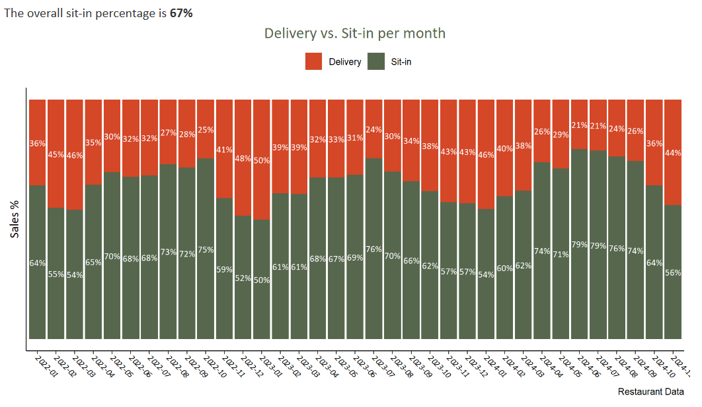

## Sales Report using R and R Markdown
[back to main page](README.md)


This is an example graph created using the ggplot2 library.


This is the code used to generate the R markdown file.


```R

{css, echo = FALSE}
body{
  font-family: Calibri;
  font-size: 12pt;
  }
  
#TOC {color: #56674D;
  }
  
  .list-group-item.active, .list-group-item.active:focus, .list-group-item.active:hover {
    z-index: 2;
    color: #fff;
    background-color: #56674D;
    border-color: #56674D;
}

h1 {
  background-color: #56674D;
  color: #FFFFFF;
    text-align: center;
    font-size: 20;
    }
    
h2 {color: #56674D;
    text-align: ;
    font-size: 15;
    font-weight: bold;
    }
    
h3 {color: "black";
    text-align: ;
    font-size: 7;
    font-weight: bold;
    }   
```

```{r setup, include=FALSE}
knitr::opts_chunk$set(include = FALSE, echo = FALSE)
```

```{r Libraries,Data Import and Cleaning}
library(lubridate)
library(tidyr)
library(dplyr)
library(hms)
library(magrittr)
library(ggplot2)
library(unikn)
library(readr)
library(crosstalk)
library(scales)
library(RColorBrewer)
library(ggrepel)
library(zoo)
library(knitr)

Sys.setlocale("LC_TIME", "English")
setwd("C:/Users/HP/OneDrive/Pizzeria/Data/La Gamba Data - R")
# Data Cleaning ####

cheques22 <- read.csv("Cheques In Details_22.csv", header = TRUE,
                    encoding = "UTF-8")
cheques23 <- read.csv("Cheques In Details_23.csv", header = TRUE,
                      encoding = "UTF-8")
cheques24 <- read.csv("Cheques In Details_24.csv", header = TRUE,
                      encoding = "UTF-8")

cheques <- bind_rows(cheques22,cheques23,cheques24)

##tidy up

colnames(cheques)
cheques <- cheques %>% select(- Close.Date, - Document.Number, -Store, - Cheque.Number, - Table, - Waiter, - Discount.Pers, - Cash, -Non.cash,- Refunded, - Consignment,- Service.Outs, - Cheque.Duration,- Visitors, - Cashbox.POS.Terminals,- X.U.FEFF..U.2116.)

##Dates and times
cheques$Opening.date <- parse_date_time(cheques$Opening.date, orders = c("ymd_HMS","dmy_HM"))

cheques$Opening.date <- as_datetime(ymd_hms(cheques$Opening.date))

cheques$original.date <- as.Date(cheques$Opening.date)
cheques$time <- hms::as_hms(cheques$Opening.date)


##filters
cheques <- filter(cheques, Status =='Completed')
cheques <- filter(cheques, original.date !='2022-01-03')


##change to actual date

cheques$actual.date <- 
   ifelse(cheques$time < hm("9:00"), 
         cheques$original.date - days(1),
         cheques$original.date)

cheques$actual.date <- as.Date(cheques$actual.date,  origin = "1970-01-01")
cheques$month <- format_ISO8601(cheques$actual.date, precision = "ym")
cheques$DOW <- wday(cheques$actual.date, label=TRUE)
cheques$year <- year(cheques$actual.date)


#### colors ####
gamba.colors <- c("#56674D", "#EFB912", "#d44727", "#d17e7e", "#000000", 
                  "#0000FF", "#5F9EA0", "#CAFF70","#9932CC", "#ADD8E6",
                  "#8B7D7B", "#8B0000","#8B0050")

```

```R
Data Frames
#totals/day
daily.total <-  cheques %>% 
  group_by(actual.date) %>% 
  summarize(daily.total = sum(Total.Amount)
  ) %>% 
  mutate(rolling.14d.average = rollmean(daily.total, 
                                       k = 14, fill = NA))

##totals/month
monthly.total <- cheques %>% 
  group_by(year.only = year(actual.date),
           month.only = month(actual.date, label = TRUE),
           month) %>% 
  summarize(total = sum(Total.Amount))


#average/day/month
monthly.average <- daily.total %>% 
  group_by(year.only = year(actual.date),
           month.only = month(actual.date, label = TRUE),
           month = format_ISO8601(actual.date, precision = "ym")) %>% 
  summarize(Average = mean(daily.total)
  )
##rolling average
rolling.14d.average <- daily.total %>% 
  mutate(rolling.14d.average = rollmean(daily.total, 
         k = 14, fill = NA))

  


#sales delivery vs. sit-it


delivery.perc <- cheques %>% 
  group_by(month,Type) %>% 
  summarize(delivery_sit_in = sum(Total.Amount)) %>% 
  mutate(perc = paste0(100*round(delivery_sit_in/sum(delivery_sit_in),
                                 2),
                       "%")) %>%
   ungroup

overall.delivery.perc <- cheques %>% 
  group_by(Type) %>% 
  summarize(sales = sum(Total.Amount)) %>% 
  mutate(perc = paste0(100*round(sales/sum(sales),2),"%")) %>% 
  filter(Type == "Table")

delivery.average <- cheques %>% 
  group_by(actual.date,Type) %>% 
  summarize(Sum = sum(Total.Amount)) %>% 
  group_by(month = format_ISO8601(actual.date, precision = "ym"),Type) %>% 
  summarize(Average = mean(Sum))

delivery.total <- cheques %>% 
  group_by(actual.date,Type) %>% 
  summarize(Sum = sum(Total.Amount)) %>% 
  group_by(month = format_ISO8601(actual.date, precision = "ym"),Type) %>% 
  summarize(sum = round(sum(Sum)))

daily.total.gamba <-  cheques %>%
  filter(Type == "Table") %>% 
  group_by(actual.date) %>% 
  summarize(daily.total = sum(Total.Amount)
  ) %>% 
  mutate(rolling.14d.average = rollmean(daily.total, 
                                       k = 14, fill = NA))

daily.total.delivery <-  cheques %>%
  filter(Type == "Order") %>% 
  group_by(actual.date) %>% 
  summarize(daily.total.delivery = sum(Total.Amount)
  ) %>% 
  mutate(rolling.14d.average.delivery = rollmean(daily.total.delivery, 
                                       k = 14, fill = NA))

daily.total.by.type <- 
  left_join(daily.total.gamba,daily.total.delivery,by="actual.date")


#sales time before vs. after 5pm
cheques <- cheques %>% 
  mutate(sales.time = case_when(time > hm("09:00") & time < hm("17:00")  ~ "before 5pm" ,
                                TRUE ~ "after 5pm"))

sales.time <- cheques %>%
  filter(Type == "Table") %>% 
  group_by(month,sales.time) %>% 
  summarize(sales.amount = sum(Total.Amount)) %>% 
  mutate(perc = paste0(100*round(sales.amount / sum(sales.amount),2),"%")) %>% 
  ungroup()

time.average <- cheques %>% 
  filter(Type == "Table") %>%
  group_by(actual.date,sales.time) %>% 
  summarize(Sum = sum(Total.Amount)) %>% 
  group_by(month = format_ISO8601(actual.date, precision = "ym"),sales.time) %>% 
  summarize(Average = mean(Sum))


#quarterly statistics

quarterly.total <- daily.total %>% 
  mutate(Q = as.yearqtr(actual.date, format="%Yq%q")) %>%
  group_by(Q) %>%
summarize(Q.total = sum(daily.total))

quarterly.average <- daily.total %>% 
  mutate(Q=as.yearqtr(actual.date, format="%Yq%q")) %>% 
  group_by(Q) %>% 
  summarize(Q.average = round(mean(daily.total)))


##yearly statistics ####
sales.year <- daily.total %>% 
  group_by(year = year(actual.date)) %>% 
  summarize(Total = round(sum(daily.total),0))

sales.year.average <- daily.total %>%
  group_by(year = year(actual.date)) %>% 
  summarize(Average = round(mean(daily.total),0))


year.delivery.sum <- cheques %>% 
  group_by(year,Type) %>% 
  summarize(total = round(sum(Total.Amount)))

year.delivery.sum$total <- format(year.delivery.sum$total,big.mark = ",")

year.delivery.average <- cheques %>% 
  group_by(actual.date,Type) %>% 
  summarize(Sum = sum(Total.Amount)) %>% 
  group_by(year=year(actual.date),Type) %>% 
  summarize(Average = round(mean(Sum))) %>% 
  spread(key=Type, value = Average) %>% 
  rename(sit_in.average = Table, delivery.average = Order) %>% 
  mutate(sit_in.perc = (100*round(sit_in.average / (sit_in.average+delivery.average),2)))

yearly.sales <- merge(merge(sales.year,sales.year.average,by="year"),
                      year.delivery.average, by ="year") 


yearly.sales1 <- merge(merge(sales.year,sales.year.average,by="year"),
                      year.delivery.average, by ="year") 

### yearly running total
  running.total <- daily.total %>% 
    mutate(year = year(actual.date)) %>% 
    group_by(year) %>% 
    mutate(running.total = cumsum(daily.total)) %>% 
    mutate(day.of.year = yday(actual.date)) 
```


```R
{r Plots code, error=TRUE}
windowsFonts(A = windowsFont("Calibri"))
mytheme <- 
  theme(plot.title = element_text(size = 15, hjust = 0.5, colour = "#56674D",
                                  family = "A"),
               plot.subtitle = element_text(face = "italic", hjust = 0.5, 
                                            family = "A"),
       axis.text.x = element_text(family = "A", size = 8, colour = "black", 
                                   face = "italic", angle = 315, vjust = .5,
                                  hjust = 0),
        axis.text.y = element_text(family = "A", size = 8, colour = "black", face = "italic"),
        axis.title.x = element_text(family = "A", size = 12, colour = "black"),
        axis.title.y = element_text(family = "A", size = 12, colour = "black"),
        axis.line = element_line(colour = "black"),
        panel.background = element_blank()
                                   )

## daily totals
hline <- round(mean(daily.total$daily.total),0)
min.date <- min(daily.total$actual.date)

p1 <- daily.total %>% 
  ggplot(aes(actual.date, daily.total))+
  geom_line(colour = "#56674D", size = 0.3, linetype = 1) +
  geom_line(mapping = aes(actual.date,rolling.14d.average),
            colour = "#d44727", size  = 1) +
  labs(
    y = "Sales amount (GEL)",
    x = NULL,
    title = "Daily Sum of Sales and Rolling 14 Day Average",
    caption = "Restaurant Data") +
 scale_x_date(breaks = date_breaks("months"),
                            labels = date_format("%b-%y")) +
  mytheme


##running total year
 
p1.1 <- running.total %>% 
  ggplot(aes(day.of.year,running.total, color = factor(year), group = year))+
  geom_line(size = 1) +
    scale_y_continuous(labels = scales::comma)+
  labs(
     y = "Yearly running total (GEL)",
     x = "Day of Year",
     title = "Yearly Running total of sales",
     caption = "Restaurant Data",
     color = "Year") +
   mytheme + 
   theme(legend.position = "top")
    
## monthly totals 

p2 <- monthly.total %>% 
  ggplot(aes(year.only,month.only, fill=total)) +
  geom_tile(color = "white",
            lwd = 1.5,
            linetype = 1)+
  geom_text(aes(label = comma(total)), color = "white") +
  scale_fill_gradient2("YlOrRd") +
  labs(title = "Sales Comparison by Year and Month",
       x = "Year", y = "Month") +
  mytheme +
  theme(legend.position = "none")

## Monthly average #### 

#area chart average per month
p3 <- monthly.average %>%
ggplot(aes(year.only,month.only, fill=Average)) +
  geom_tile(color = "white",
            lwd = 1.5,
            linetype = 1)+
  geom_text(aes(label = comma(Average)), color = "white") +
  scale_fill_gradient2("YlOrRd") +
  labs(title = "Sales Average Comparison by Year and Month",
       x = "Year", y = "Month") +
  mytheme +
  theme(legend.position = "none")


## Delivery vs. Sit in

p4 <- delivery.perc %>% 
   ggplot(aes(month,delivery_sit_in , fill = Type)) +
  geom_col (position = "fill") +
    scale_fill_manual (values = c("#d44727","#56674D"), 
                       labels = c("Delivery","Sit-in")) +
   geom_text(aes(y = delivery_sit_in, label = ifelse(perc > 10, 
                                                     perc, "")), 
             position = position_fill(vjust = 0.5),
             colour = "white",
             size = 3,
             family ="A")+
    labs(
      y = "Sales %",
      x = NULL,
      title = "Delivery vs. Sit-in per month",
      caption = "Restaurant Data") +
  mytheme +
  theme (legend.position = "top",
        legend.title = element_blank(),
        axis.text.y = element_blank(),
        axis.ticks.y = element_blank())
   

p5 <- delivery.average %>% 
  ggplot(aes(month,Average, fill = Type)) + 
  geom_col (position = "dodge") +
  scale_fill_manual(values = c("#d44727","#56674D"), 
                    labels = c("Delivery","Sit-in"))+
  geom_text(aes(label = sprintf("%0.0f", round(Average, digits = 0))),
            position = position_dodge(.9),
            hjust = +1.1,
             angle = 90,
             size = 3,
            color = "White",
            family = "A") +
  labs(
    y = "Sales (in GEL)",
    x = NULL,
    title = "Delivery vs. Sit-in Average",
    caption = "Restaurant Data") +
  mytheme +
  theme (legend.position = "top",
         legend.title = element_blank(),
         axis.text.y = element_blank(),
         axis.ticks.y = element_blank())

p5.1 <- delivery.total %>% 
  ggplot(aes(month,sum, fill = Type)) + 
  geom_col (position = "dodge") +
  scale_fill_manual(values = c("#d44727","#56674D"), 
                    labels = c("Delivery","Sit-in"))+
  geom_text(aes(label = comma(sum)),
             position = position_dodge(.9),
             hjust = +1.1,
             angle = 90,
             size = 3, 
             color = "White",
             family = "A") +
  labs(
    y = "Sales (in GEL)",
    x = NULL,
    title = "Delivery vs. Sit-in total",
    caption = "Restaurant Data") +
  mytheme +
  theme (legend.position = "top",
         legend.title = element_blank(),
         axis.text.y = element_blank(),
         axis.ticks.y = element_blank())

p12 <- daily.total.by.type %>% 
   ggplot(aes(actual.date, rolling.14d.average))+
   geom_line(colour = "#56674D", size = 0.5, linetype = 1) +
   geom_line(mapping = aes(actual.date,rolling.14d.average.delivery),
             colour = "#d44727", size  = 0.5)+
   labs(
     y = "Sales amount (GEL)",
     x = NULL,
     title = "Rolling 14 Day Average Sit-in vs. Delivery",
     subtitle = NULL,
     caption = "Restaurant Data") +
  geom_rect(xmin = as.Date("2022-05-01"), 
              xmax = as.Date("2022-05-05"),  
              fill = "#56674D") +
    annotate(geom= "text",
             x = as.Date("2022-05-05"),
             hjust = -0.1,
             label = "Sit-in",
             family = "A") +
    geom_rect(xmin = as.Date("2022-05-01"), 
              xmax = as.Date("2022-05-05"),  
              fill = "#d44727") +
    annotate(geom= "text",
             x = as.Date("2022-05-05"), y =1625,
             hjust = -0.1,
             label = "Delivery",
             family = "A") +
   scale_x_date(breaks = date_breaks("months"),
                labels = date_format("%b-%y")) +
   mytheme

##Sales per time of day

p6 <- sales.time %>% 
   ggplot(aes(month, sales.amount, fill = sales.time))+
   geom_col(position = "fill") +
   scale_fill_manual (values = c("#56674D","#EFB912"), 
                      labels = c("After 5pm","Before 5pm")) +
   geom_text(aes(y = sales.amount, label = ifelse(perc > 10,
                                                  perc,"")), 
             position = position_fill(vjust = 0.5),
             colour = "white",
             size = 3,
             family = "A")+
   labs(
     y = "Sales %",
     x = NULL,
     title = "Time of Sales per month",
     caption = "Restaurant Data") +
   mytheme +
   theme (legend.position = "top",
          legend.title = element_blank(),
          axis.text.y = element_blank(),
          axis.ticks.y = element_blank())

p13 <- time.average %>% 
    ggplot(aes(month,Average, fill = sales.time)) + 
    geom_col (position = "dodge") +
    scale_fill_manual(values = c("#56674D", "#EFB912"), 
                      labels = c("After 5pm","Before 5pm"))+
    geom_text(aes(label = sprintf("%0.0f", round(Average, digits = 0))),
              position = position_dodge(.9),
              hjust = +1.1,
             angle = 90,
             size = 3,
              color = "White",
              family = "A") +
    labs(
      y = "Sales (in GEL)",
      x = NULL,
      title = "Sales per Month",
      subtitle = "Average per time of day",
      caption = "Restaurant Data") +
    mytheme +
    theme (legend.position = "top",
           legend.title = element_blank(),
           axis.text.y = element_blank(),
           axis.ticks.y = element_blank())

## quarterly sales####

 p14 <-  quarterly.total %>% 
   ggplot(aes(Q ,Q.total)) +
 geom_line(colour = "#56674D", size = 0.7) +
   geom_point(colour = "#EFB912", size = 2) +
  geom_label(aes(label=comma(Q.total)),
            vjust = -0.5)+
   labs(
     y = "Sales amount (GEL)",
     x = "Quarter",
     title = "Sum of sales per quarter",
     caption = "Restaurant Data") +
   mytheme
 
p15 <-  quarterly.average %>% 
   ggplot(aes(Q,Q.average)) +
   geom_line(colour = "#56674D", size = 0.7) +
   geom_point(colour = "#EFB912", size = 2) +
   geom_label(aes(label=comma(Q.average)),
            vjust = -0.5)+
    labs(
      y = "Sales amount (GEL)",
     x = "Quarter",
     title = "Daily average sales per quarter",
     caption = "Restaurant Data") +
   mytheme

```
