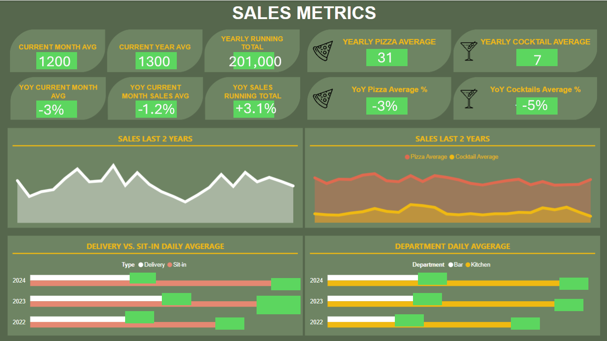

## PowerBi Dashboard

[back to main page](README.md)

This is a dashboard I made for my restaurant using Python, SQL and PowerBi. The data is changed for the purpose of this portfolio.

The final output was this sales KPI dashboard.



```python
import pandas as pd
import sqlite3
```


```python
#connect in pandas and SQL

#create and connect to database
conn = sqlite3.connect('lagamba.sqlite')
cur = conn.cursor()
#Load the CSV into a DataFrame and mergen the tables
#links to csv files
csv_cheques = [r'C:\Users\HP\OneDrive\Pizzeria\Data\La Gamba Data - R\Cheques In Details_22.csv',
             r'C:\Users\HP\OneDrive\Pizzeria\Data\La Gamba Data - R\Cheques In Details_23.csv',
             r'C:\Users\HP\OneDrive\Pizzeria\Data\La Gamba Data - R\Cheques In Details_24.csv']


#delete existing tables
cur.execute('''DROP Table if EXISTS cheques;
           ''')

#Iterate over CSV files and import them as temporary tables
for i, file in enumerate(csv_cheques):
    # Load CSV into a DataFrame
    df_cheques = pd.read_csv(file)

     #replace spaces in column titles with '_'
    df_cheques.columns = df_cheques.columns.str.replace(' ', '_')
    
    # Name temporary table uniquely for each file
    temp_cheques = f'temp_cheques_{i}'

    # Write DataFrame to temporary table in SQLite
    df_cheques.to_sql(temp_cheques, conn, if_exists='replace', index=False)

# UNION the temporary tables
union_query = ' UNION ALL '.join([f"SELECT Opening_date, Customer, Type, Total_Amount, Status FROM temp_cheques_{i}"
                                  for i in range(len(csv_cheques))])

#create final table with index
cur.execute('''
    CREATE TABLE cheques (
    id INTEGER PRIMARY KEY AUTOINCREMENT,
    Opening_date TEXT,
	Customer TEXT,
	Type TEXT,
	Amount REAL,
	Status TEXT
);'''
)
    
#add the union query to the index table    
cur.executescript(
    f"""WITH union_table AS({union_query})
    INSERT INTO cheques (Opening_date, Customer, Type, Amount, Status)
    SELECT Opening_date, Customer, Type, Total_Amount, Status 
    FROM union_table;"""
)

#drop the temporary tables
for i in range(len(csv_cheques)):
    cur.execute(
    f"DROP TABLE IF EXISTS temp_cheques_{i}")

#perform necessary time calculations
cur.executescript(
'''
-- Add new columns to the cheques table (hour and date only from timestamp)
ALTER TABLE cheques ADD COLUMN hour INT;
ALTER TABLE cheques ADD COLUMN sales_date TEXT;

-- Update sales date based on the hour of sales using a subquery
-- Sales after midnight still count to the day before. I use 9am as arbitrary time.
-- Some times cheques were closed very late, but never later than 9am
UPDATE cheques
	SET 
	hour = strftime('%H', Opening_date),
	sales_date = CASE 
		WHEN strftime('%H', Opening_date) < '09' 
		THEN DATE(Opening_date, '-1 day') 
		ELSE DATE(Opening_date)
	END;

-- Rename Sit-in and delivery

UPDATE cheques
SET Type = CASE
    WHEN Type = 'Table' THEN 'Sit-in'
    WHEN Type = 'Order' THEN 'Delivery'
    ELSE Type
END
WHERE Type IN ('Table', 'Order');
	
-- delete invalid data. 2022-01-03 was just a test day. And only completed cheques
DELETE FROM cheques
WHERE 
sales_date = '2022-01-03' OR 
Status != 'Completed';

-- We remove the opening_date and status column as we will not use it again in our model. We only use actual sales date
ALTER TABLE cheques
DROP COLUMN Opening_date;
ALTER TABLE cheques
DROP COLUMN Status;
'''
)
# Close the connection
conn.commit()
```


```python
#ITEMS
#Load the CSV into a DataFrame and mergen the tables
#links to csv files
csv_items = [r'C:\Users\HP\OneDrive\Pizzeria\Data\La Gamba Data - R\Sales by dish by day_22.csv',
             r'C:\Users\HP\OneDrive\Pizzeria\Data\La Gamba Data - R\Sales by dish by day_23.csv',
             r'C:\Users\HP\OneDrive\Pizzeria\Data\La Gamba Data - R\Sales by dish by day_24.csv']

#delete existing tables
cur.execute('''DROP Table if EXISTS items;
           ''')

#Iterate over CSV files and import them as temporary tables
for i, file in enumerate(csv_items):
    # Load CSV into a DataFrame
    df_items = pd.read_csv(file)

     #replace spaces in column titles with '_'
    df_items.columns = df_items.columns.str.replace(' ', '_')
    
    # Name temporary table uniquely for each file
    temp_items = f'temp_items_{i}'

    # Write DataFrame to temporary table in SQLite
    df_items.to_sql(temp_items, conn, if_exists='replace', index=False)

# UNION the temporary tables
union_query_items = ' UNION ALL '.join([f"SELECT Date, Category, Name, Quantity, Amount FROM temp_items_{i}"
                                  for i in range(len(csv_items))])

#create final table with index
cur.execute('''
    CREATE TABLE items (
    id INTEGER PRIMARY KEY AUTOINCREMENT,
    Date TEXT,
    Category TEXT,
    Name TEXT,
    Quantity REAL,
    Amount REAL
);'''
)
    
#add the union query to the index table    
cur.executescript(
    f"""WITH union_table_items AS({union_query_items})
    INSERT INTO items (Date, Category, Name, Quantity, Amount)
    SELECT Date, Category, Name, Quantity, Amount
    FROM union_table_items;"""
)

#drop the temporary tables
for i in range(len(csv_items)):
    cur.execute(
    f"DROP TABLE IF EXISTS temp_items_{i}")

#perform necessary modificatoin
cur.executescript(
'''
-- delete invalid data. 2022-01-03 was just a test day. And only completed cheques
DELETE FROM items
WHERE 
date = '2022-01-03';

-- change some category names
UPDATE items
SET category = "Cocktails"
WHERE category = "Alcoholic Drinks"
'''
)
# Close the connection
conn.commit()

```


```python
#PAYOUT INFO
#Load the CSV into a DataFrame and mergen the tables
#links to csv files
csv_profit = [r'C:\Users\HP\OneDrive\Pizzeria\Data\La Gamba Data - R\Payout information.csv']

#delete existing tables
cur.execute('''DROP Table if EXISTS profit;
           ''')

#Iterate over CSV files and import them as temporary tables
for i, file in enumerate(csv_profit):
    # Load CSV into a DataFrame
    df_profit = pd.read_csv(file)

     #replace spaces in column titles with '_'
    df_profit.columns = df_profit.columns.str.replace(' ', '_')
    
    # Name temporary table uniquely for each file
    temp_profit = f'temp_profit_{i}'

    # Write DataFrame to temporary table in SQLite
    df_profit.to_sql(temp_profit, conn, if_exists='replace', index=False)

# UNION the temporary tables
union_query_profit = ' UNION ALL '.join([f"SELECT Date,	Payout_Recipient, Payout_Amount, Payout_Reason FROM temp_profit_{i}"
                                  for i in range(len(csv_profit))])

#create final table with index
cur.execute('''
    CREATE TABLE profit (
    id INTEGER PRIMARY KEY AUTOINCREMENT,
    Date TEXT,
    Payout_Recipient TEXT,
    Payout_Amount TEXT,
    Payout_Reason REAL
);'''
)
    
#add the union query to the index table    
cur.executescript(
    f"""WITH union_table_profit AS({union_query_profit})
    INSERT INTO profit (Date,	Payout_Recipient, Payout_Amount, Payout_Reason)
    SELECT Date, Payout_Recipient, Payout_Amount, Payout_Reason
    FROM union_table_profit;"""
)

#drop the temporary tables
for i in range(len(csv_profit)):
    cur.execute(
    f"DROP TABLE IF EXISTS temp_profit_{i}")
    
# Close the connection
conn.commit()

```

```python
conn.close()
```


    

