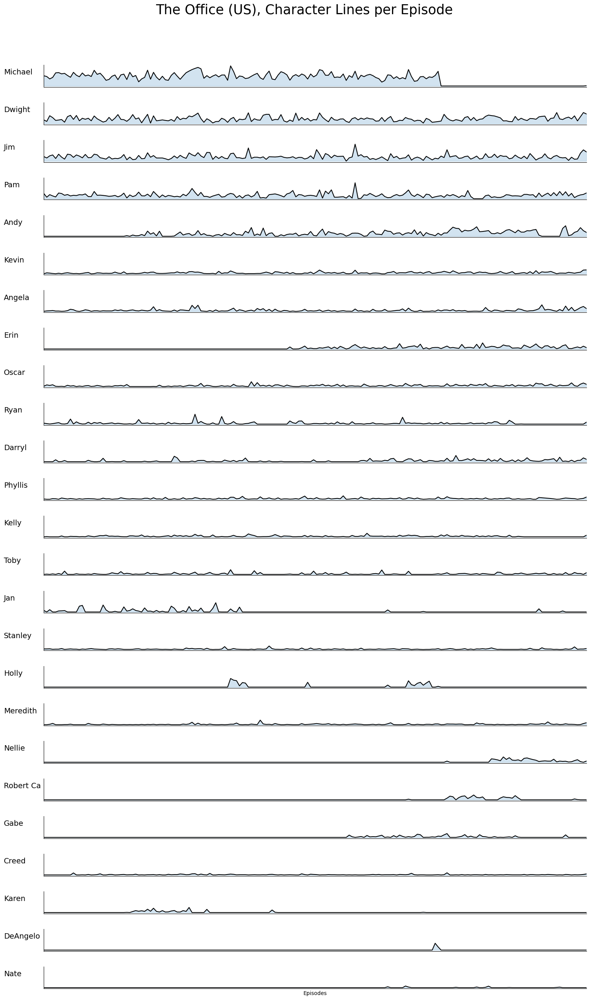

## Webscraping #Python #Pandas #Matplotlib

**[Back to main page](README.md)**

I used Python to scrape a website hosting all the scripts for The Office (US) and created a visualization showing the number of lines per episode, both in chronological order and sorted by average lines from most to least.

The primary libraries I used were BeautifulSoup, Pandas, and Matplotlib.

**Here’s the final output: a ridgeline plot:**



Import the necessary libraries
```python
import urllib.request, urllib.parse, urllib.error
import requests
from bs4 import BeautifulSoup
import ssl
from collections import Counter
```

Scrape the website
The episodes are distributed accross 3 subsequent pages. I could figure out how to automatize this, but given that it is only 3 pages, for now I post the links here.
```python
links = ['https://transcripts.foreverdreaming.org/viewforum.php?f=574',
          'https://transcripts.foreverdreaming.org/viewforum.php?f=574&start=78',
           'https://transcripts.foreverdreaming.org/viewforum.php?f=574&start=156' ]

# Create an empty list to store the dictionaries with the character-line count of each page
search_results = []

#base url that I need to access each page.
base_url = 'https://transcripts.foreverdreaming.org/'
```

Loop through the 3 links (3 pages) and get all the individual links to each episode
```python
for link in links[:]: #to speed up the testing I started with [:1] to only check the 1st link
    
    # Use BeautifulSoup to parse the links
    page = requests.get(link)
    soup = BeautifulSoup(page.text, 'html')
    
    a_tag = soup.find_all('a', class_='topictitle') #there are many links on this page (advertising, social media, etc.). 
    #luckily the links to the scripts of the episode are identified with the attribute 'topictitle'
    
    #print(a_tag) -> works

    #I now have all the a-tags and need to now retrieve html and follow the links to the page. I do this by looping through all the a-tags
    for tag in a_tag [2:]: #I started by only following 2 html to speed up the testing [0:2] turns out the first 2 htmls are some 
        #deleted scenes episodes, so I excluded them by testing [2:4]
        
        episode_url = tag.get('href', None)
        #print(episode_url) -> works

        #concatenate the base_url and the url that I found. The 'episode_url' alone is not enough because it is just the ulr without the base url
        full_episode_url = base_url + episode_url
        #print(full_episode_url) -> works

        #I now have a list of all the final URLs to the episode scripts. time to open them and extract the text
        response = requests.get(full_episode_url) #follow the URL
        tagsoup = BeautifulSoup(response.text, 'html') #get the html text
        character_line = tagsoup.find_all('strong') #'strong' is the attribute that indicates the Character name. I'm not interested
        #in what they say, but only if they say something. In other words, if they had a line to say in the script.
        #print(character_lines) -> works

        #time to find the episode and season number. I need this to identify the episode in the end
        identifier = tagsoup.find('h3', class_ = 'first') #the 3rd header with the attribute 'first' contains this information
        identifier = identifier.text.strip() #looks like this: "01x01 - Pilot"
        season = int(identifier[0:2]) #extract season number (first two sring positions)
        episode = int(identifier[3:5]) #extract episode number (3rd to 5th string positions)

        #much later I realized that there are some episodes that are numbered as "99" indicating deleted scenes. I want to eliminate them.
        #since each season has a maximum of 28 episodes, I filter out every episode number above 28.
        if episode >28 or episode == 0:
            continue
        #print(identifier) -> works

        #time to quantify how many lines each character had in each episode
        #create a list of all the line by character
        line = [line.text.strip() for line in character_line[4:]] #the first 4 lines are some random info on the page that I don't need
        #print(line) #-> #works


        #this next step was inserted later. it had to be done...too many columns (characters). I filter only for the main characters
        #taking into account some spelling mistakes that I found

        main_characters = ['Michael','Michael:','Dwight','Dwight:','Jim','Jim:','Pam','Pam:','Andy','Angela','Ryan','Ryan [on phone]',
                           'Creed','Robert California','Robert','Stanley','Kevin','Kevin:','Oscar','Oscar:','Phyllis','Phyllis:',
                           'Kelly','Kelly:','Darryl','Darryl:','Toby','Jan','Jan [on phone]','Erin','Erin:','DeAngelo','Meredith','Nellie','Gabe',
                          'Holly','Karen','Nate']

        line = [character for character in line if character in main_characters]
        #occurrences = {key: occurrences[key] for key in main_characters if key in occurrences} 

        #change the spelling mistakes
        key_change = {'Michael:': 'Michael', 'Dwight:': 'Dwight', 'Jim:' : 'Jim', 'Pam:':'Pam', 'Robert' : 'Robert Ca',
                    'Kevin:': 'Kevin', 'Phyllis:' : 'Phyllis', 'Kelly:':'Kelly', 'Jan [on phone]' : 'Jan','Ryan [on phone]': 'Ryan',
                     'Oscar:' : 'Oscar', 'Darryl:':'Darryl','Erin:':'Erin','Robert California' : 'Robert Ca'}

        #change the list with correction
        line = [key_change.get(name,name) for name in line]

        #count how many lines each character had 
        occurrences = Counter(line)

        #time to add the season and episode number to my dictionary (see above)
        occurrences.update({'episode': episode, 'season': season})

        #and finally append the dictionaries into the search_results list that I created at the start. Loop by loop each episode will be added
        search_results.append(occurrences)
```

Test if it worked
```python
#print(search_results)
#WORKS!!
```

Convert the list to a Pandas dataframe
```python
import pandas as pd

#create an empty list of data frames
dfs = []

#loop through the dictionary and format them as data frames using pandas. 
for occurrences in search_results:
    df = pd.DataFrame([occurrences])

    #append the created data frames into the list loop by loop
    dfs.append(df) 

#concatenate the data frames into a single table. Each column will be a character and each row an episode
occurrences_table = pd.concat(dfs, ignore_index=True).fillna(0)
#occurrences_table works
```

Last tweaks to the Dataframe
```python
# Reorder columns with 'episode' and 'season' at the front. I want this to see right away which episode the row is
priority_columns = ['season', 'episode']
cols = priority_columns + [col for col in occurrences_table.columns if col not in priority_columns]

# Apply the new column order
final_table = occurrences_table[cols]
final_table

final_table.to_pickle('Office_lines')
```

```
Create the visualization.
Start by importing libraries
```python
import matplotlib.pyplot as plt
import pandas as pd
import seaborn as sns
import numpy as np
df = pd.read_pickle(r'C:\Users\HP\OneDrive\Phyton\Portfolio/Office_lines')
#df
```

Sort the characters by most to least average lines.
```python
df = df.iloc[::-1].reset_index(drop=True) 

# Calculate the average of each column excluding zeros
def average_excluding_zeros(column):
    non_zero_values = column[column != 0]
    return non_zero_values.mean() if not non_zero_values.empty else np.nan

averages = df.mean()

# Sort columns by these averages from highest to lowest
sorted_columns = averages.sort_values(ascending=False).index

# Reorder the DataFrame based on sorted columns
df = df[sorted_columns]
df
```


```python
#pivot
df.reset_index(inplace = True) 
df.rename(columns = {'index': 'Index'}, inplace=True)
df_melt = pd.melt(
    df, id_vars = ['Index','season', 'episode'], 
    var_name = 'Character', value_name = 'lines')

df_melt
```


Final visualization
```python
#create the ridgeline plot
g = sns.FacetGrid(df_melt,col='Character', col_wrap = 1, height = 1,
                 aspect = 15)
g.map(sns.lineplot, 'Index', 'lines', color = 'black')
g.map(plt.fill_between, 'Index', 'lines', alpha=0.2)

for ax in g.axes.flat:
    
    category_label = ax.get_title().split('=')[-1]  # Extract category from the title
    ax.set_ylabel(f'{category_label.strip()}',fontsize= '14', labelpad=75, rotation=0, ha='left')
g.set_titles('')
g.set(xlim=(df_melt['Index'].min(), df_melt['Index'].max()))
ax.set_xlabel('Episodes')
# Remove the axis labels
g.set(xticks=[], yticks=[])

g.fig.suptitle('The Office (US), Character Lines per Episode', y=1.05, fontsize = 25)  # Main title


# Save the plot as a PNG file
g.savefig("theoffice_lines.png")  # Provide the file name here

```

   


Some extra interesting analysis. Like who had lines in every episode and average lines per episode
```python
#do some extra analysis
has_zero = (df == 0).any()

print('Columns containing 0: ' )
print(has_zero)
print('\nAverage per character (only appearing espisodes): ')

df_mean = df.replace(0, np.nan)
average1 = df_mean.mean().sort_values(ascending = False)
print(average1)
print('\nAverage per character (all episodes): ')
print(averages.sort_values(ascending = False))
```

    Columns containing 0: 
    
    Michael       True
    Dwight       False
    Jim           True
    Pam           True
    Andy          True
    episode      False
    Kevin         True
    Angela        True
    Erin          True
    Oscar         True
    Ryan          True
    Darryl        True
    season       False
    Phyllis       True
    Kelly         True
    Toby          True
    Jan           True
    Stanley       True
    Holly         True
    Meredith      True
    Nellie        True
    Robert Ca     True
    Gabe          True
    Creed         True
    Karen         True
    DeAngelo      True
    Nate          True
    dtype: bool
    
    Average per character (only appearing espisodes): 
    
    Michael      80.222222
    DeAngelo     39.500000
    Dwight       36.951087
    Jim          34.196721
    Holly        32.647059
    Pam          27.655556
    Andy         26.178571
    Jan          20.769231
    Robert Ca    19.136364
    Nellie       16.030303
    Erin         14.309278
    Karen        12.520000
    episode      12.423913
    Darryl       11.336538
    Angela        9.107143
    Gabe          8.977778
    Ryan          8.676471
    Kevin         8.634831
    Oscar         8.355828
    Toby          7.616822
    Kelly         6.043478
    Phyllis       5.871166
    Nate          5.500000
    season        5.472826
    Meredith      4.289062
    Stanley       4.104294
    Creed         3.062016
    dtype: float64
    
    Average per character (all episodes): 
    Michael      58.858696
    Dwight       36.951087
    Jim          34.010870
    Pam          27.054348
    Andy         19.918478
    episode      12.423913
    Kevin         8.353261
    Angela        8.315217
    Erin          7.543478
    Oscar         7.402174
    Ryan          6.413043
    Darryl        6.407609
    season        5.472826
    Phyllis       5.201087
    Kelly         4.532609
    Toby          4.429348
    Jan           4.402174
    Stanley       3.635870
    Holly         3.016304
    Meredith      2.983696
    Nellie        2.875000
    Robert Ca     2.288043
    Gabe          2.195652
    Creed         2.146739
    Karen         1.701087
    DeAngelo      0.429348
    Nate          0.298913
    dtype: float64
    


